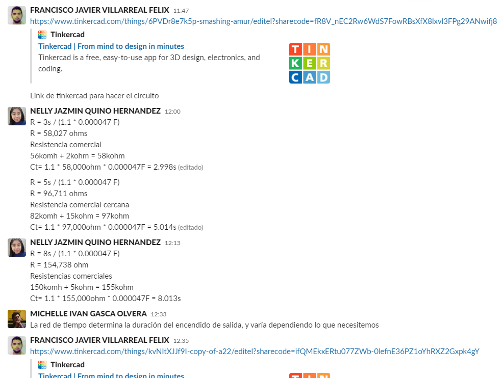

## :trophy: A.1.4 Learning Activity

Carry out a start and ignition control system for an electric actuator through an electronic circuit, using a simulator, a **NE55s Timer** and a **DC Motor**.

## :pencil2: Development

1. Use the following list of materials to prepare the activity

| Amount | Description                            |
| -------- | -------------------------------------- |
| 1        | Circuito integrado LM555               |
| 1        | Capacitor electrolítico de 47uf        |
| 1        | Condensador cerámico de 10nf           |
| 1        | Fuente de voltaje de 9V                |
| 1        | Transistor de poder TIP122             |
| 1        | Diodo 1N4001 o equivalente             |
| 1        | Mini Motor DC                          |
| 3        | Resistencias 680,1k,10k Ohmios de 1/4w |
| 1        | Pulsador de disparo                    |
| 1        | Diodo Led Rojo                         |

2. Use the electronic circuit in the picture below and assemble stage 1 inside the simulator.

    

    

3. As can be seen in the previous circuit, there is an area identified as "Time network" and another "Decoupling filter", **explain the purpose of both terminologies**.

    The time network determines the duration of the output ignition, and varies depending on what we need

    The decoupling filter is used to eliminate noise from the output signal, so that it can be read more easily by the next part of the circuit.

4. Continuing with the previous image, observe the equation Ct = 1.1 * R1 * C1 is shown, which is used to establish the **on time of the output pulse**. Based on this previous equation, calculate the values ​​of **R1 and C1** if it is desired to keep the output pulse on, given the 3 conditions required in the attached table.

    | Number | Condition  | R1 value | C1 value |
    | ------ | ---------- | ----------- | ----------- |
    | 1      | 3 seconds |58KΩ| 47μF|
    | 2      | 5 seconds |97KΩ| 47μF|
    | 3      | 8 seconds |155KΩ| 47μF|

    R = 3s / (1.1 * 0.000047 F) 

    R = 58,027 ohms
    
    **Comercial resistance**

    56komh + 2kohm = 58kohm

    Ct= 1.1 * 58,000ohm * 0.000047F = 2.998s
    
    --------------
    R = 5s / (1.1 * 0.000047 F)

    R = 96,711 ohms

    **Comercial resistance**

    82komh + 15kohm = 97kohm

    Ct= 1.1 * 97,000ohm * 0.000047F = 5.014s

    --------------
    R = 8s / (1.1 * 0.000047 F)

    R = 154,738 ohm

    **Comercial resistance**

    150komh + 5kohm = 155kohm

    Ct= 1.1 * 155,000ohm * 0.000047F = 8.013s

5. Once the above table is completed, start the simulation for any of the three conditions and observe the behavior of the Led; **explain your observation**.

    For each of the calculations we can see that little by little the LED goes off since the charging time it has decreases unless we restart it with the button

6. Assemble stage 2 and integrate the terminal of the output pulse to the input of the base of the transistor of this second stage.

    

7. After completing the previous step, choose one of the 3 conditions recorded in the table above and observe the behavior of the DC motor; **explain your observation**.

    We choose condition number 3, of 8 seconds, and we observe that the motor starts as soon as the button is pressed.

8. Once the stage 1 output pulse on time is complete, **what happens to the DC motor? Explain the reason for this behavior?**

The motor ends up shutting down when the stored current runs out.

9. Insert images of **evidence** such as meetings of the team members held for the development of the activity

    

    

___

## :beetle: Nelly Quino

In the first part I observe how was the switch off the led after passing current with the pushbutton due to how were we varying size the resistance and the capacitor wich are connected to a timer 555, we  used it for 3,5 and 8 seconds. In second part we added a DC motor to the circuit and in  a on an oscilloscope watched how it was vary the signal.

## :camera: Michelle Gasca

The 555 timer provides extensive control in different practices such as time delay control, it can also generate pulses and oscillations, as it can be deactivated at different times depending on the determined time.

## :coffee: Francisco Villarreal 

The 555 timer helps us a lot to carry out practices or systems where we occupy an activity to be carried out during a certain time, although we must always take into account the precautions that must be taken that is why the use of capacitors was necessary to help calculate the time that wanted to have the engine and LED turned on.

### :bomb: Rubric

| Criteria| Description | Score |
| ------------- | -------------------------------------------------------------------------------------------- | ------- |
| Instructions | Do you fulfill each of the points indicated in the instruction section? | 10 |
| Sevelopment    | Did you answer each one of the points requested in the development of the activity?   | 60      |
|Demonstration|Was the student present in the explanation of the functionality of the activity?|20| 
|Conclusions|Se incluye una opinión personal de la actividad por cada uno de los integrantes del equipo?|10|

### :mortar_board: Members repositories

:beetle: [Nelly Quino](https://github.com/NellyQuino/SistemasProgramables)

:camera: [Michelle Gasca](https://github.com/C3XDN/Sistemas-programables)

:coffee: [Francisco Villarreal](https://github.com/FranciscoVF/Sistemas-Programables/)
