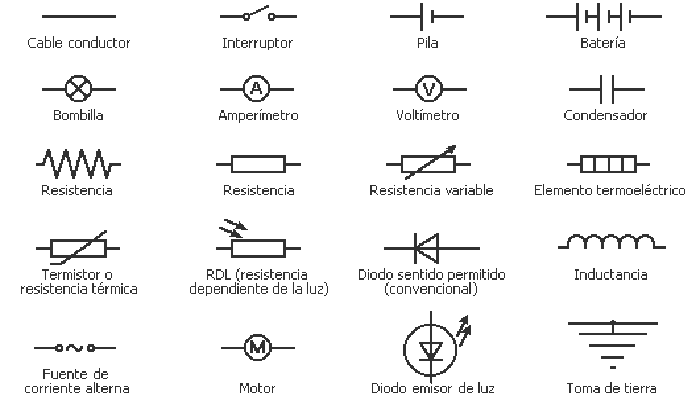

#### Parte I

1. Que debe existir entre dos puntos de un circuito para que los electrones circulen por el?
   - [ ] Una diferencia de potencia entre los dos puntos del circuito
   - [ ] No tiene que haber ninguna diferencia de potencia entre los dos puntos 
   - [ ] Una diferencia de resistencia entre los dos puntos del circuito
2. Por donde salen los electrones de una pila, en  una condición ideal?
   - [ ] Por el polo negativo
   - [ ] Por el polo positivo
   - [ ] Por ambos polos
3. Si necesitamos un hilo de cobre que ofrezca mucha resistencia eléctrica, cual de los siguientes deberíamos elegir?, considerando como analogía un cable que viaje una señal digital como un cable de ethernet.
   - [ ] Un hilo largo y grueso
   - [ ] Un hilo corto y grueso
   - [ ] Un hilo corto y delgado
4. Cual de las siguiente unidades de medida se emplea para medir potencia
   - [ ] Ohmio
   - [ ] Wattio
   - [ ] Amperio
   - [ ] Voltios
5. Como debemos conectar varias pilas si queremos obtener mas tensión que la suministrada por una sola de ellas?
   - [ ] Serie
   - [ ] Paralelo
   - [ ] Simple
   - [ ] Compuesto

#### Parte II

1. A continuación relacione cada símbolo electrónico colocando la letra que aparece abajo de cada uno de ellos.

- [ ] Cable conductor  
- [ ] Bombilla
- [ ] Resistencia fija
- [ ] Diodo Led
- [ ] Interruptor
- [ ] Amperimetro
- [ ] Resistencia variable
- [ ] Toma de tierra
- [ ] Pila
- [ ] Voltimetro
- [ ] Fuente de corriente alterna
- [ ] Batería
- [ ] Condensador
- [ ] Motor

 
        

