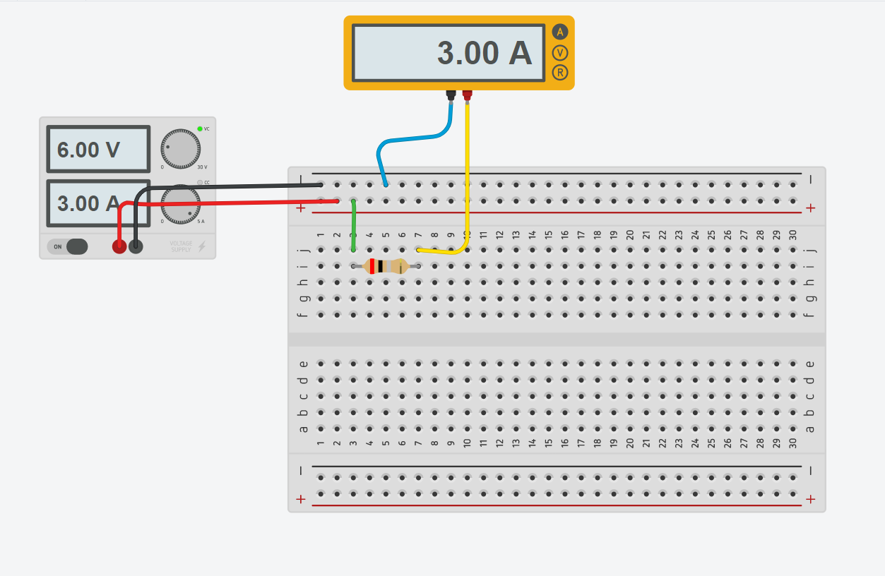
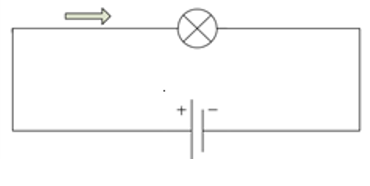
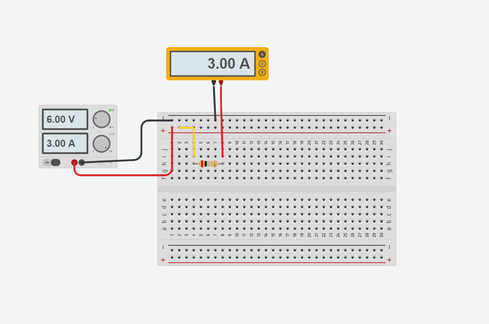
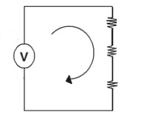

## :trophy: C1.2 Reto en clase

**Conceptos de electrónica básica y simulacion de circuitos**

### :blue_book: Instrucciones
___

- De acuerdo con la información presentada por el asesor referente al tema electrónica básica, contestar las preguntas indicadas dentro del apartado desarrollo 
- Diseñar los circuitos mostrados dentro de la herramienta ***tinkercad***.
- Analice los tres siguientes circuitos y responder a lo que se pregunta en cada uno de ellos, **explicando** como se obtuvo el resultado y una vez realizado los cálculos teóricos, utilice el simulador propuesto y diseñe los circuitos realizando la simulación y demostración de los resultados obtenidos.
- Toda actividad o reto se deberá realizar utilizando el estilo **MarkDown con extension .md** y el entorno de desarrollo VSCode, debiendo ser elaborado como un documento **single page**, es decir si el documento cuanta con imágenes, enlaces o cualquier documento externo debe ser accedido desde etiquetas y enlaces.
- Es requisito que el archivo .md contenga una etiqueta del enlace al repositorio de su documento en Github, por ejemplo **Enlace a mi GitHub**
- Al concluir el reto el reto se deberá subir a github el archivo .md creado.
- Desde el archivo **.md** se debe exportar un archivo **.pdf** con la nomenclatura **C1.2_TituloActividad_NombreAlumno.pdf**, el cual deberá subirse a classroom dentro de su apartado correspondiente, para que sirva como evidencia de su entrega; siendo esta plataforma **oficial** aquí se recibirá la calificación de su actividad por individual.
- Considerando que el archivo .pdf, fue obtenido desde archivo .md, ambos deben ser idénticos y mostrar el mismo contenido.
- Su repositorio ademas de que debe contar con un archivo **readme**.md dentro de su directorio raíz, con la información como datos del estudiante, equipo de trabajo, materia, carrera, datos del asesor, e incluso logotipo o imágenes, debe tener un apartado de contenidos o indice, los cuales realmente son ligas o **enlaces a sus documentos .md**, _evite utilizar texto_ para indicar enlaces internos o externo.
- Se propone una estructura tal como esta indicada abajo, sin embargo puede utilizarse cualquier otra que le apoye para organizar su repositorio.

``` 
| readme.md
| | blog
| | | C1.1_TituloActividad.md
| | | C1.2_TituloActividad.md
| | | C1.3_TituloActividad.md
| | img
| | docs
| | | A1.1_TituloActividad.md
| | | A1.2_TituloActividad.md
```
#C1.2 Circuito electrónico básico
### :pencil2: Desarrollo
___
**Circuitos electronicos**

1. Un circuito que tiene una pila de 6 voltios genera una corriente que atraviesa una resistencia eléctrica de 2 ohmios. Cual es el valor de la intensidad de la corriente que pasa por la resistencia?

    <p align="left">
            
    </p>


    +  Registre sus cálculos obtenidos y los simulados 

    Elemento | Valor teórico | Valor simulación
    ---------|----------|---|
    Intensidad | 3 A | 3 A |
    
       Fórmula I = V / R
       Desarrollo: 
       I = 6 V / 2 ohmios
       I = 3 A 

 + Coloque aquí las imágenes de evidencia de la simulación.
    <p align="left">
            
    </p>
___

2. Encuentre la tensión de la pila que necesitas para que pase una corriente cuya intensidad es de 3 amperes por una bombilla que tiene 2 ohmios de resistencia.

    <p align="left">
        
    </p>

    + Registre sus cálculos obtenidos y los simulados: 

    Elemento | Valor teórico | Valor simulación
    ---------|----------|---|
    Voltaje | 6V  | 6 V|
       
       Fórmula V = I * R
       Desarrollo: 
       V = 3 A * 2 ohmios
       V = 6 V


    + Coloque aquí las imágenes de evidencia de la simulación.
   <p align="left">
            
    </p>
___

1. Encuentre la corriente eléctrica total y el voltaje en cada resistencia que se encuentra dentro del circuito, considerando los siguientes valores resistivos,

    <p align="left">
        
    </p>

  + Registre sus cálculos obtenidos y los simulados: 
    Elemento | Valor teórico | Valor simulación
    ---------|----------|---|
    R1 | 80 ohms | 80 ohms|
    R2 | 120 ohms | 120 ohms|
    R3 | 12 ohms |  12 ohms|
    VT | 60 volts | 60 volts|
    VR1 | 22.64 volts | 22.6 V|
    VR2 | 33.96 volts | 34.0 V |
    VR3 | 3.39 volts | 3.40 V |
    IT |  0.283 A | 283 mA|

        Fórmula RT = R1 + R2 + R3, IT = V / RT, V = I * R
        Desarrollo
        RT = 80 ohms + 120 ohms + 12 ohms
        RT = 212 ohms
         
        IT = 60 V / 212 ohms 
        IT = 0.283
        
        V1 = 0.283 * 80 ohms 
        v1 = 22.64 V
        V2 = 0.283 * 120 ohms 
        v2 = 33.96 V
        V3 = 0.283 * 12 ohms 
        v3 = 3.39 V

        VT = 22.64 + 33.96 + 3.39 
        VT = 59.99


  + Coloque aquí las imágenes de evidencia de la simulación.
   <p align="left">
            
    </p>


:memo:  [Actividad C1.2](https://github.com/NellyQuino/SistemasProgramables/blob/main/Blog/C1.2_Circuito_electronico_basico_NellyQuino.md)

:house: [Mi GitHub](https://github.com/NellyQuino/SistemasProgramables)

________________________________________________________________________

### :bomb: Rubrica

| Criterios     | Descripción                                                                                  | Puntaje |
| ------------- | -------------------------------------------------------------------------------------------- | ------- |
| Instrucciones | Se cumple con cada uno de los puntos indicados dentro del apartado Instrucciones?            | 20 |
| Desarrollo    | Se respondió a cada uno de los puntos solicitados dentro del desarrollo de la actividad?     | 80      |


