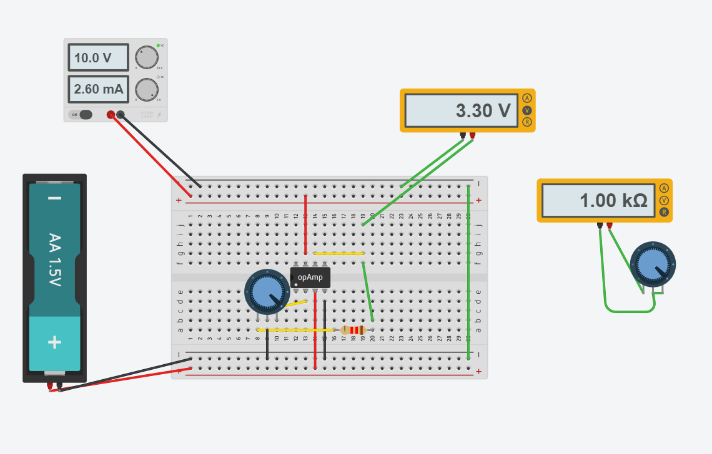

## Sensores
___
### :trophy: C1.4 Reto en clase

**Circuito electrónico para el acondicionamiento de señal con un amplificador operacional y simulación**

### :blue_book: Instrucciones

___

- De acuerdo con la información presentada por el asesor referente al tema acondicionadores de señal, contestar lo que se indica dentro del apartado desarrollo.
- Simule el circuito mostrado utilizando la herramienta tinkercad para ello.
- Toda actividad o reto se deberá realizar utilizando el estilo **MarkDown con extension .md** y el entorno de desarrollo VSCode, debiendo ser elaborado como un documento **single page**, es decir si el documento cuanta con imágenes, enlaces o cualquier documento externo debe ser accedido desde etiquetas y enlaces.
- Es requisito que el archivo .md contenga una etiqueta del enlace al repositorio de su documento en Github, por ejemplo **Enlace a mi GitHub**
- Al concluir el reto el reto se deberá subir a github el archivo .md creado.
- Desde el archivo **.md** se debe exportar un archivo **.pdf** con la nomenclatura **C1.4_NombreAlumno_Equipo.pdf**, el cual deberá subirse a classroom dentro de su apartado correspondiente, para que sirva como evidencia de su entrega; siendo esta plataforma **oficial** aquí se recibirá la calificación de su actividad por individual.
- Considerando que el archivo .pdf, fue obtenido desde archivo .md, ambos deben ser idénticos y mostrar el mismo contenido.
- Su repositorio ademas de que debe contar con un archivo **readme**.md dentro de su directorio raíz, con la información como datos del estudiante, equipo de trabajo, materia, carrera, datos del asesor, e incluso logotipo o imágenes, debe tener un apartado de contenidos o indice, los cuales realmente son ligas o **enlaces a sus documentos .md**, _evite utilizar texto_ para indicar enlaces internos o externo.
- Se propone una estructura tal como esta indicada abajo, sin embargo puede utilizarse cualquier otra que le apoye para organizar su repositorio.

```  
| readme.md
| | blog
| | | C0.1_x.md
| | | C0.2_x.md
| | | C0.3_x.md
| | img
| | docs
| | | A0.1_x.md
| | | A0.2_x.md
```

#C1.4 Circuito electrónico para el acondicionamiento de señal con un amplificador operaciona

## :pencil2: Desarrollo

___

**Problema a resolver:**

1. Calcular el valor de R1 y R2 que se requiere, para obtener un voltaje de salida de 3.3v, dado que el Voltaje de entrada es de 1.5v? Explique el procedimiento utilizado para realizar el cálculo y considere valores comerciales para las resistencias que se considere utilizar.

<p align="center">
    
</p>

    Fórmula
    Vsalida = Ventrada(1 + R2/R1)
    
    Despejamos la fórmual
    vsalida/Ventrada = 1 + R2/R1
    (vsalida/Ventrada) - 1 = R2/R1
    ((vsalida/Ventrada) - 1) * R1 = R2

    Sutituimos los valores que tenemos
    ((3.3v/1.5v)-1) * 1 kohms = R2
    R2 = 1.2 kohms
    
    Comprobación 
    Vsalidad = 1.5v (1 + 1.2 kohms /1 kohms)
    Vsalidad = 3.3v
    

2. Diseñe y simule el circuito utilizando la herramienta Tinkercad.

<p align="center">
    
</p>


3. Cambie el valor de R1 o R2 por un potenciómetro de tal forma que pueda compensar una salida de voltaje tal como se muestra en la tabla siguiente:

Vo | Resistencia | R2
---------|----------|---|
~1v|  -- | 1.2 kohms|
~2v | -- |1.2 kohms|
~3v | 1 kohm |1.2 kohms |
~4v | 720 ohms | 1.2 kohms|
~5v | 501 ohms |1.2 kohms |


4. Coloque aqui evidencias de la simulación.

El valor ~1 y ~2 no se pudieron obtener con los valores que teniamos de r1 y r2, solo obtiene valores en el rango de 1.5v y 10v. Y en el otro ques para ~2 lo menos que nos dio es 3.3 

<p align="center">
    
</p>
<p align="center">
    
</p>
<p align="center">
    
</p>

___

### :bomb: Rubrica

| Criterios     | Descripción                                                                                  | Puntaje |
| ------------- | -------------------------------------------------------------------------------------------- | ------- |
| Instrucciones | Se cumple con cada uno de los puntos indicados dentro del apartado Instrucciones?            | 20 |
| Desarrollo    | Se respondió a cada uno de los puntos solicitados dentro del desarrollo de la actividad?     | 80      |

### :bookmark: Enlaces

:memo:  [Actividad C1.4](https://github.com/NellyQuino/SistemasProgramables/blob/main/Blog/C1.4_Acondicionador_de_senal_AmOP_NellyQuino.md)

:house: [Enlace a mi GitHub](https://github.com/NellyQuino/SistemasProgramables)
