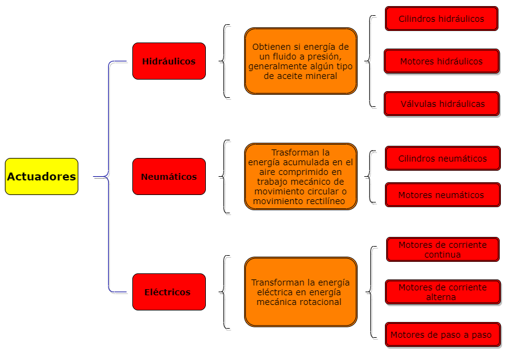
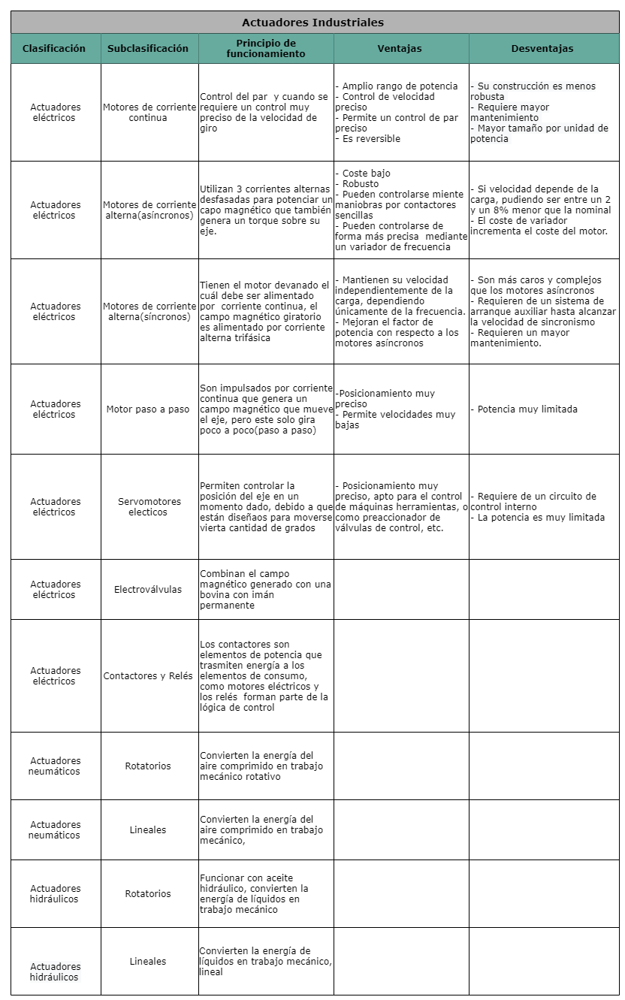

# Actuadores
___


### :trophy: C2.1 Reto en clase 

**Atuadores Neumaticos e Hidraulicos y sus tipos**

### :blue_book: Instrucciones

- De acuerdo con la información presentada por el asesor referente al tema actuadores y a los videos
observados sobre el mismo tema, elabore lo que se solicita dentro del apartado desarrollo.
- Toda actividad o reto se deberá realizar utilizando el estilo **MarkDown con extension .md** y el entorno de
desarrollo VSCode, debiendo ser elaborado como un documento single page, es decir si el documento
cuanta con imágenes, enlaces o cualquier documento externo debe ser accedido desde etiquetas y enlaces.
Es requisito que el archivo .md contenga una etiqueta del enlace al repositorio de su documento en
Github, por ejemplo **Enlace a mi GitHub**
- Al concluir el reto el reto se deberá subir a github el archivo .md creado.
- Desde el archivo **.md** se debe exportar un archivo **.pdf** con la nomenclatura
**C2.1_TituloActividad_NombreAlumno.pdf**, el cual deberá subirse a classroom dentro de su apartado
correspondiente, para que sirva como evidencia de su entrega; siendo esta plataforma **oficial** aquí se
recibirá la calificación de su actividad por individual.
- Considerando que el archivo .pdf, fue obtenido desde archivo .md, ambos deben ser idénticos y mostrar el mismo contenido.
- Su repositorio ademas de que debe contar con un archivo **readme**.md dentro de su directorio raíz, con la información como datos del estudiante, equipo de trabajo, materia, carrera, datos del asesor, e incluso logotipo o imágenes, debe tener un apartado de contenidos o indice, los cuales realmente son ligas o **enlaces a sus documentos .md**, _evite utilizar texto_ para indicar enlaces internos o externo.
- Se propone una estructura tal como esta indicada abajo, sin embargo puede utilizarse cualquier otra que le apoye para organizar su repositorio.  
``` 
| readme.md
| | blog
| | | C2.1_TituloActividad.md
| | | C2.2_TituloActividad.md
| | | C2.3_TituloActividad.md
| | img
| | docs
| | | A2.1_TituloActividad.md
| | | A2.2_TituloActividad.md
```

### :pencil2: Desarrollo

Listado de preguntas:

1. Basándose en el video [actuadores en Robótica](https://www.youtube.com/watch?v=e_6rjEGWqoY), realice un cuadro sinóptico sobre la clasificación de los actuadores.

<p align="center">
    
</p>

1. De acuerdo con el video [descripcion de los actuadores industriales](https://www.youtube.com/watch?v=mFsPxpFHajM) realice una matriz comparativa indicando clasificacion, subclasificacion, principio de funcionamiento, ventajas y desventajas.

<p align="center">
    
</p>


1. De acuerdo con el video [Neumática Industrial](https://www.youtube.com/watch?v=Wee85cI6wwQ&t=394s), explique como trabaja un sistema Neumático?

*Los actuadores neumáticos utiliza un compresor para presurizar el aire el cual toman del ambiente en el que se encuentran para así tener energía en forma de aire comprimido, luego este aire tiene que estar seco y limpio así que pasa por una unidad de preparación* 
*Primero pasa por un separador de liquitos, el cual hace girar el aire utilizando paletas con forma especial  esto elimina la humedad no deseada debido a la afuerzza centrifuga.*
*Luego pasa por un filtro que elimina  las partículas y más  humedad, este proceso se divide en dos estappas en el pimero una serie de aspas circulan el aire y en la segunda etapa el aire pasa por una media filtrante la cual atrapa los contaminante no deseados.*
Después de estás dos estpas es común que se ajuste la presión del aire que sale del compresor.*  
Dependiendo dela  la presión es la fuerza que va a ajercer el actuador etre más presión más fuerza, menor presión menor fuerza, para ellos se utiliza un regulador. 
*Finalmente una vez echos los pasos anteriores va hacia un valvula de control direccional la cual contiene  vias internas las cual pueden conectar el aire que llega al puerto de entrada hacia los puertos de trabajo dependiendo también utiliza carretes para bloquear el aire en un camino haciendo que paso por otro, con un solenoide que es controlado por un PLC, que genera un campo magnético que empuja el carrete que es empujado a la izquierda por un resorte al lado contrario. Y se puede regresar el vástago al enviando aire comprimido hacai el otro lado para que lo regrese todo dpendera de la direccion a la se mande el aire comprimido.*


### :bomb: Rubrica

| Criterios     | Descripción                                                                                  | Puntaje |
| ------------- | -------------------------------------------------------------------------------------------- | ------- |
| Instrucciones | Se cumple con cada uno de los puntos indicados dentro del apartado Instrucciones?            | 20 |
| Desarrollo    | Se respondió a cada uno de los puntos solicitados dentro del desarrollo de la actividad?     | 80      |

### :bookmark: Ligas

:memo: [Actividad C2.1 ](https://github.com/NellyQuino/SistemasProgramables/blob/main/Blog/C1.5_Tipo_de_sensores_de_acuerdo_con_su_uso_aplicativo_NellyQuino.md)

:house: [Ir a mi GitHub](https://github.com/NellyQuino/SistemasProgramables)
